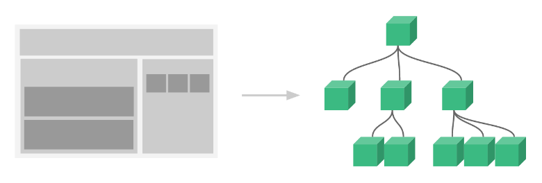

# 学习资料
- [官方教程](http://vuejs.org.cn/guide/)
- [Vue.js——vue-router 60分钟快速入门](http://www.cnblogs.com/keepfool/p/5690366.html)

## 安装

```
# 全局安装 vue-cli
$ npm install -g vue-cli
# 创建一个基于 "webpack" 模板的新项目
$ vue init webpack my-project
# 安装依赖，走你
$ cd my-project
$ npm install
$ npm run dev
```

## 起步

```HTML:

<div id="app">
  <input v-model="newTodo" v-on:keyup.enter="addTodo">
  <ul>
    <li v-for="todo in todos">
      <span>{{ todo.text }}</span>
      <button v-on:click="removeTodo($index)">X</button>
    </li>
  </ul>
</div>

```

```JS:

new Vue({
  el: '#app',
  data: {
    newTodo: '',
    todos: [
      { text: 'Add some todos' }
    ]
  },
  methods: {
    addTodo: function () {
      var text = this.newTodo.trim()
      if (text) {
        this.todos.push({ text: text })
        this.newTodo = ''
      }
    },
    removeTodo: function (index) {
      this.todos.splice(index, 1)
    }
  }
})
```

##概述

###响应的数据绑定
- Vue.js 的核心是一个响应的数据绑定系统，它让 **数据 与 DOM 保持同步** 非常简单。
- 应用中的逻辑就几乎都是 **直接修改数据** 了，不必与 DOM 更新搅在一起
- 这让我们的代码 **更容易撰写、理解与维护**
- 

```HTML:

<!-- 这是我们的 View -->
<div id="example-1">
  Hello {{ name }}!
</div>
```

```JS:

// 这是我们的 Model
var exampleData = {
  name: 'Vue.js'
}

// 创建一个 Vue 实例或 "ViewModel"
// 它连接 View 与 Model
var exampleVM = new Vue({
  el: '#example-1',
  data: exampleData
})
```

结果：`Hello Vue.js!`


###组件系统
- 它提供了一种抽象，让我们可以用 **独立可复用的小组件** 来构建大型应用
- 几乎任意类型的应用的界面都可以 **抽象为一个组件树**
- 
```HTML:

<div id="app">
  <app-nav></app-nav>
  <app-view>
    <app-sidebar></app-sidebar>
    <app-content></app-content>
  </app-view>
</div>
```
- 你可能已经注意到 Vue.js 组件非常类似于自定义元素——它是 Web 组件规范的一部分，但是，有几个关键的不同：
    + Vue.js 组件不需要任何补丁，并且在所有支持的浏览器（IE9 及更高版本）之下表现一致
    + Vue.js 组件提供了原生自定义元素所不具备的一些重要功能，比如组件间的数据流，自定义事件系统，以及动态的、带特效的组件替换


##Vue 实例

###构造器
- 每个 Vue.js 应用的起步都是 **通过构造函数** Vue 创建一个 **Vue 的根实例**
- 一个 Vue 实例其实正是一个 MVVM 模式中所描述的 ViewModel
- 在实例化 Vue 时，需要传入一个选项对象，它可以包含：
    + 数据
    + 模板
    + 挂载元素
    + 方法
    + 生命周期钩子
    + ...

###属性与方法
每个 Vue 实例都会代理其 data 对象里所有的属性：
```
var data = { a: 1 }
var vm = new Vue({
  data: data
})

vm.a === data.a // -> true

// 设置属性也会影响到原始数据
vm.a = 2
data.a // -> 2

// ... 反之亦然
data.a = 3
vm.a // -> 3
```

Vue 实例暴露了一些有用的实例属性与方法。这些属性与方法都有前缀 $，以便与代理的数据属性区分
```
var data = { a: 1 }
var vm = new Vue({
  el: '#example',
  data: data
})

vm.$data === data // -> true
vm.$el === document.getElementById('example') // -> true

// $watch 是一个实例方法
vm.$watch('a', function (newVal, oldVal) {
  // 这个回调将在 `vm.a`  改变后调用
})
```

###实例生命周期
- Vue 实例在创建时有一系列初始化步骤——例如，它需要建立数据观察，编译模板，创建必要的数据绑定
- 在此过程中，它也将调用一些生命周期钩子，给自定义逻辑提供运行机会
```
var vm = new Vue({
  data: {
    a: 1
  },
  created: function () {
    // `this` 指向 vm 实例
    console.log('a is: ' + this.a)
  }
})
// -> "a is: 1"
```
其它的钩子，在实例生命周期的不同阶段调用，如 compiled、 ready 、destroyed

###生命周期图示


##数据绑定语法

###插值
- 文本 `<span>Message: {{ msg }}</span>`
- HTML `<div>{{{ raw_html }}}</div>`
- HTML特性 `<div id="item-{{ id }}"></div>`


###绑定表达式

####JavaScript 表达式
```
{{ number + 1 }}

{{ ok ? 'YES' : 'NO' }}

{{ message.split('').reverse().join('') }}
```

####过滤器 
- 以“管道符”指示 `{{ message | capitalize }}`
- 过滤器可以串联 `{{ message | filterA | filterB }}`
- 过滤器也可以接受参数 `{{ message | filterA 'arg1' arg2 }}`

###指令
- v-bind 指令用于响应地更新 HTML 特性
```
<a v-bind:href="url"></a>
   ------ ----  ---
     |      |    |
    指令  参数  表达式
```

也可以这样 `href="{{url}}"` 实际上在内部特性插值会转为 v-bind 绑定

- v-on 指令，它用于监听 DOM 事件
```
<a v-on:click="doSomething">
   ---- -----  -----------
     |    |         |
    指令 参数    表达式
```

- 修饰符 (Modifiers) 是以半角句号 . 开始的特殊后缀
```
<a v-bind:href.literal="/a/b/c"></a>
               -------
                  |
    修饰符告诉指令将它的值解析为一个字面字符串而不是一个表达式
```

###缩写
- v- 前缀是一种标识模板中特定的 Vue 特性的视觉暗示
- Vue.js 会管理所有的模板，此时 v- 前缀也没那么重要了
- v-bind 缩写
```
<!-- 完整语法 -->
<a v-bind:href="url"></a>

<!-- 缩写 -->
<a :href="url"></a>

<!-- 完整语法 -->
<button v-bind:disabled="someDynamicCondition">Button</button>

<!-- 缩写 -->
<button :disabled="someDynamicCondition">Button</button>
```

- v-on 缩写
```
<!-- 完整语法 -->
<a v-on:click="doSomething"></a>

<!-- 缩写 -->
<a @click="doSomething"></a>
```

##计算属性
- 基础例子
```
HTML:
<div id="example">
  a={{ a }}, b={{ b }}
</div>

JS:
var vm = new Vue({
  el: '#example',
  data: {
    a: 1
  },
  computed: {
    // 一个计算属性的 getter
    b: function () {
      // `this` 指向 vm 实例
      return this.a + 1
    }
  }
})

结果:
a=1, b=2

如果:
console.log(vm.b) // -> 2
vm.a = 2
console.log(vm.b) // -> 3
```
**vm.b 的值始终取决于 vm.a 的值**

- 计算 setter
计算属性默认只是 getter，不过在需要时你也可以提供一个 setter：
```
// ...
computed: {
  fullName: {
    // getter
    get: function () {
      return this.firstName + ' ' + this.lastName
    },
    // setter
    set: function (newValue) {
      var names = newValue.split(' ')
      this.firstName = names[0]
      this.lastName = names[names.length - 1]
    }
  }
}
// ...
```
vm.fullName = 'John Doe' 时，setter 会被调用，vm.firstName 和 vm.lastName 也会有相应更新